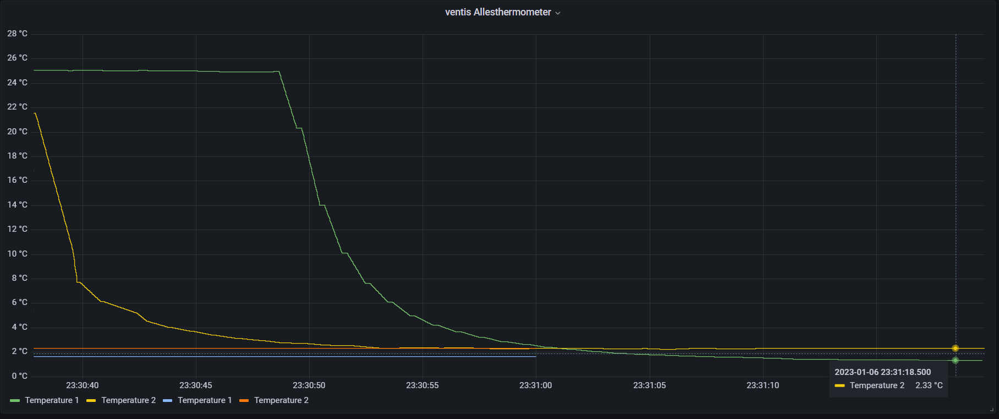

# Temperature logger

Lets build an accurate temperature sensor with wifi/mqtt support for any kind of experiment which needs data logging.

## Costs
* each Sensor: 20€
* each readout board: 15€
* ESP32: 10€
* I2C Display: 5€

It will come down to just below 100€. (A cheap thermometer without the data logging functionality costs only 15€ each)

_Note. This a loose collection of bits and peaces, not a complete tutorial_

# Hardware

Minimum hardware for one channel sensor readout (the actual sensor is in the next image) Note that one needs 6 leads to fully connect the readout board including chip select. The connector in the image has only 5 leads.

## Sensor
PT 100, e.g. 'T-100-Pt100-PRO' - up to 250°C with a silicon cable and three wires for extra accuracy

## µController

ESP32 (preferred) or ESP8266 to install ESPEasy. Tip: Install ESPEasy with the web installer

## Sensor readout
1 or 2 PT100. I used the food friendly lance shaped 
One PT100 readout board per sensor. It will be connected via SPI. The PT100 MAX31865 boards from Adafruit or (I used) the (cheaper) ones from Hailege.
The important part: Don't forget to configure the board for the three pin sensor by soldering one 2 bridges and cut one existing bridge with a knive. *Use a mulitmeter to check if the bridge is really cut*

## Display

Optional some random I2C OLED mini display

## Power supply

Any 5V USB charger or power bank will do

# Case
3D print or laser cut something to store the lances and electronics. Preferably to protect the electronics a bit from water and other food. 

I used a custom design made of plywood, a laser cutter and boxes.py

# Software

ESPEasy in the flavor 'Climate'. This Version supports the little OLED display as well as the PT100 readout boards.

Optional: An MQTT Broker in your local network for temperature logging. 

# Installation

Solder each MAX31865 board to one of the SPI ports, use for each board a separate CS pin.
Solder the I2C pins to the OLED.

You can configure the initial wifi settings over serial, if needed. 'wifiscan, 'wifissid' and 'wifikey' are the needed commands.

# Configuration

Thermosensors plugin - Tip: Configure the readout interval to 1s to get real time updates

For local review of the temperature

Don't forget to activate I2C and SPI pins

Tip: configure the OLED to also show the IP of the ESP to simplify your life.

# Calibration
The fun part. Mix water with ice and measure the temperature. Each sensor should measure more or less exactly 0°C. This is more or less independent of your location on the earth. In my case sensor A read +1.10°C and sensor B read +2.13°C. To check if this is a constant offset I used boiling water. Since I am not a see level, but at 337m, I used an online calculator to calculate that water boils at 98.9°C. I saw a similar offset of 100.25°C and 101.39°C (which is a bit more than the offset at the freezing point). I adjusted the offset to reflect the freezing point, that this measurement is more accurate. For sure one could also change the reference value of the 430Ohm reference resistor to further adjust, but for food related measurements the accuracy is more than enough.

The following images are screenshots of grafana, plotting the data published through a MQTT broker

Boiling water in a water cooker, two sensors with a slightly different offset 

Water and ice mixture

After offset calibration freezing water is measured around 0°C

The final product